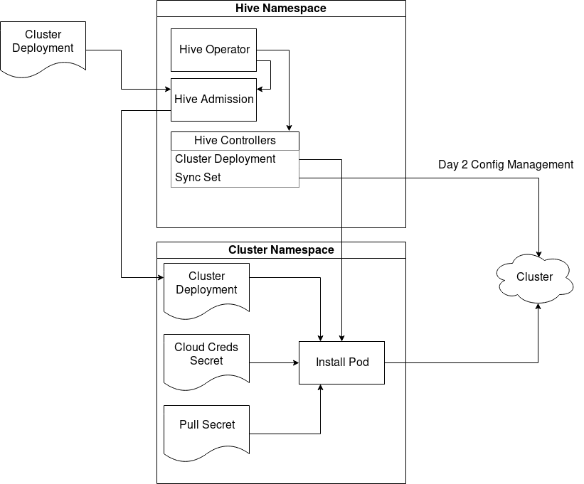

# OpenShift Hive Architecture

OpenShift Hive is a Kubernetes operator built to provide a declarative API to provision, configure, reshape, and deprovision OpenShift clusters at scale. Hive's API is a set of Kubernetes Custom Resource Definitions, served by the Kubernetes apiserver.

Hive leverages the [OpenShift Installer](https://github.com/openshift/installer) to perform cluster provisioning and deprovisioning.

## Components

 1. **Hive Operator**: First Hive pod to run, acts as a deployer. Manages the Kubernetes Deployments for other components to ensure they are properly configured and running. Also handles migrations and cleanup and anything else that might require programatic logic in a long term Hive deployment. Reconciles on a HiveConfig CRD which provides some configuration options for Hive itself.
 1. **Hive Admission**: Small stateless HTTP server used for CRD webhook validation. Its only responsibility is to approve or deny creation or updates to our core CRDs.
 1. **Hive Controllers**: Core Hive controllers which reconcile all CRDs.

## How Hive Works

API callers create ClusterDeployments which contain the desired state for the cluster they would like to provision. Hive is designed to work in a multi-tenant environment, so ClusterDeployments and their associated secrets can be created in separate namespaces. This allows for protecting access to data with standard Kubernetes RBAC.

ClusterDeployments define the OpenShift release image to install, either directly on the ClusterDeployment, or by linking to a pre-existing ClusterImageSet. A ClusterImageSet is a small CRD which links an OpenShift release image to a corresponding Hive image that works with that particular installer version.

Once a ClusterDeployment is created, Hive will perform a few pre-install steps such as determining which OpenShift installer image to use (by extracting the reference in the release image we are installing), and optionally creating a DNS zone for the cluster.

Once these steps are completed, an install pod will be launched. The install pod consists of two containers, the installer extracted from the specified release image, and a Hive installmanager sidecar container named 'hive'. The openshift-install binary is copied from the install container into the installmanager container where we can execute it and upload required artifacts during and after the install is completed.

In the event of an install failure, Hive will cleanup any cloud resources created and keep trying indefinitely (with backoff).

Once the install completes successfully, the admin password and kubeconfig will be uploaded as secrets and linked to the ClusterDeployment. Controllers related to day 2 configuration management now begin reconciling to apply Kubernetes configuration to the end cluster itself (predominantly via the [SyncSet](syncset.md) CRD and controller).

When a ClusterDeployment is deleted, a deprovision job will spawn which repeatedly tries to teardown all known cloud resources matching the cluster's infra ID tag, until nothing is left.

For more information about additional features please see [Using Hive](using-hive.md).

## Supported Clouds

Today Hive supports provisioning clusters on AWS, with additional cloud providers coming soon, roughly as support is added in OpenShift 4 itself.

