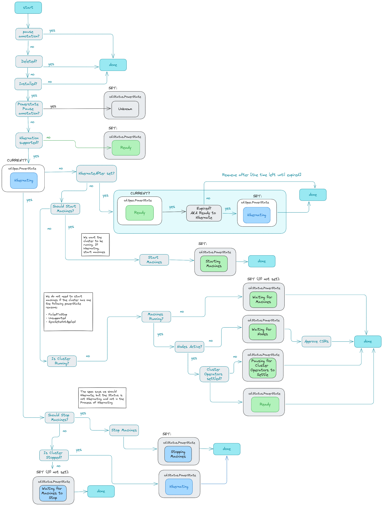

# Hibernating Clusters

## Overview

Starting with OpenShift version 4.4.8, clusters can be stopped and started by simply shutting
down their machines and starting them back up. The only additional requirement to bring a cluster
back up from a stopped state is that CSRs be approved for the cluster's nodes when certificates
have expired since the cluster was active. This typically happens if the cluster is hibernated
within the first 24 hours before initial cert rotation takes place. After this phase, certs will
be valid for 30 days.

Hive can automate the process of stopping/starting clusters via its API by allowing the user to
set a the desired state of the cluster in the ClusterDeployment spec. Both API and controller
changes are required to support this feature.

## Example Commands

```bash
$ oc patch cd mycluster --type='merge' -p $'spec:\n powerState: Hibernating'
$ oc patch cd mycluster --type='merge' -p $'spec:\n powerState: Running'
```

## API Changes

The ClusterDeploymentSpec should allow setting whether machines are in a running state or in
a hibernating state.

```go
type ClusterPowerState string

const (
  // RunningClusterPowerState is the default state of a cluster after it has
  // been installed. All of its machines should be running.
  RunningClusterPowerState ClusterPowerState = "Running"

  // HibernatingClusterPowerState is used to stop the machines belonging to a cluster
  // and move it to a running state.
  HibernatingClusterPowerState ClusterPowerState = "Hibernating"
)


type ClusterDeploymentSpec struct {
  // ... other fields

  // PowerState indicates whether a cluster should be running or hibernating.
  PowerState  ClusterPowerState `json:"powerState,omitempty"`
}
```

On the status side, a cluster's state is reflected by the Hibernating condition type
and related reasons:

```go

// Cluster condition types
const (
  // ... other constants

  // ClusterHibernatingConditionType is set when the ClusterDeployment is either
  // transitioning to/from a hibernating state or is in a hibernating state.
  ClusterHibernatingConditionType ClusterDeploymentConditionType = "Hibernating"
)

// Cluster hibernating reasons
const (
  // ResumingHibernationReason is used as the reason when the cluster is transitioning
  // from a Hibernating state to a Running state.
  ResumingHibernationReason = "Resuming"

  // RunningHibernationReason is used as the reason when the cluster is running and
  // the Hibernating condition is false.
  RunningHibernationReason = "Running"

  // StoppingHibernationReason is used as the reason when the cluster is transitioning
  // from a Running state to a Hibernating state.
  StoppingHibernationReason = "Stopping"

  // HibernatingHibernationReason is used as the reason when the cluster is in a
  // Hibernating state.
  HibernatingHibernationReason = "Hibernating"

  // UnsupportedHibernationReason is used as the reason when the cluster spec
  // specifies that the cluster be moved to a Hibernating state, but either the cluster
  // version is not compatible with hibernation (< 4.4.8) or the cloud provider of
  // the cluster is not supported.
  UnsupportedHibernationReason = "Unsupported"
)
```

## Controller Changes

### Cluster Hibernation Controller
The cluster hibernation controller is a new controller that will watch ClusterDeployments and ensure that the target cluster's
machines reflect the hibernating state specified in the ClusterDeployment spec.

High level flow of controller logic:



The controller uses the actuator pattern to power up and power down machine instances as well as determining
machine state (running or stopped).

#### Selecting Cluster Machines

Option 1 (Preferred):
The hibernation controller relies on the actuator to select machines used by the cluster.
The actuator, given a ClusterDeployment's InfraID selects machines using a method appropriate to the cloud provider (tags/name prefix/resource group).

Option 2:
The hibernation controller uses the machine API on the target cluster to determine which machines belong to the cluster. It then stores the machine IDs
in the clusterdeployment (or a separate CR), then uses those machine IDs to start the cluster again.

#### Hibernation Actuator
The hibernation controller relies on an actuator to work with cloud provider machines.
This is the interface for the actuator:

```go
type HibernationActuator interface {
  // CanHandle returns true if the actuator can handle a particular ClusterDeployment
  CanHandle(cd *hivev1.ClusterDeployment) bool

  // StopMachines will start machines belonging to the given ClusterDeployment
  StopMachines(logger log.FieldLogger, cd *hivev1.ClusterDeployment, hiveClient client.Client) error

  // StartMachines will select machines belonging to the given ClusterDeployment
  StartMachines(logger log.FieldLogger, cd *hivev1.ClusterDeployment, hiveClient client.Client) error

  // MachinesRunning will return true if the machines associated with the given
  // ClusterDeployment are in a running state.
  MachinesRunning(logger log.FieldLogger, cd *hivev1.ClusterDeployment, hiveClient client.Client) (bool, error)

  // MachinesStopped will return true if the machines associated with the given
  MachinesStopped(logger log.FieldLogger, cd *hivev1.ClusterDeployment, hiveClient client.Client) (bool, error)
}
```

#### Handling Incompatible OpenShift Versions and Cloud Provider
OpenShift versions earlier than 4.4.8 do not support stopping and starting a cluster without additional work
to restore etcd. In the case that the cluster deployment's `status.clusterVersionStatus.desired.version` is
less than 4.4.8, the hibernation controller will set the Hibernating condition to `false` and set the reason
to Unsupported. This will also be the case if the cluster's cloud provider is not currently supported.
When later reconciling cluster deployments with this condition set, the hibernation controller will
continue to check the version in case the cluster is upgraded and eventually is able to be hibernated.

#### Approving CSRs
In the case that CSRs must be approved for a cluster that has had its certificates expired while hibernating,
we should follow similar checks as the [cluster machine approver](https://github.com/openshift/cluster-machine-approver/blob/0f50c7bfe9b309ce01937274598f5a807d9545df/csr_check.go)
to ensure we are not introducing an additional security exposure.

#### Resuming from a Hibernating State
When a cluster is hibernated, the unreachable controller should properly set the unreachable condition on
the cluster once it stops responding. This will cause other controllers like the remotemachineset controller to
stop trying to reconcile the cluster. Once the cluster deployment resumes, the unreachable controller should
set it back to reachable and syncing of hive controllers should resume.
